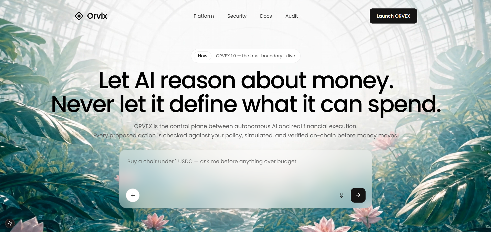

<div align="center">

# ◈ ORVEX

### The execution control plane between autonomous AI and money.

**Let AI reason about money. Never let it define what it can spend.**

<div align="center">
 
## 🎥 Orvex Demo

[](https://youtu.be/dnqY6lMGYPQ)

▶️ **[Watch Demo Video on Youtube](https://youtu.be/dnqY6lMGYPQ)**

ORVEX separates *autonomous reasoning* from *financial authority*. An AI agent may understand a goal, explore the web, compare options and propose a payment — but an independent, deterministic **Sentinel** decides whether that action is actually authorized, simulates it, executes it, and verifies the real on-chain outcome before a single unit of value moves.

[Architecture](#-architecture) · [Subsystems](#-subsystems) · [Run it locally](#-run-it-locally) · [The live demo](#-the-live-demo) · [Security model](#-security-model) · [Testing](#-testing)

</div>

---

## ✦ Why ORVEX exists

Autonomous agents are probabilistic. They can be wrong, confused, or manipulated by untrusted content on the web. That is *fine* for a planner — but catastrophic for something that can move money.

ORVEX is built on one principle:

> **The agent can be probabilistic. The authority cannot.**

The system stays safe even when the AI is wrong. The AI proposes; a deterministic control plane disposes. Money only moves when an independent boundary has re-derived the decision at execution time, simulated the exact transaction, and later verified that what happened on-chain matches what was authorized.

```
HUMAN → INTENT → AGENT BRAIN → SENTINEL FIREWALL → EXECUTION → VERIFIED RECEIPT → AUDIT
                                     │
                          ALLOW · REVIEW · BLOCK
```

---

## ✦ Architecture

ORVEX is a monorepo of four cooperating subsystems, each owning exactly one responsibility across a hard trust boundary.

```
┌──────────────────────────────────────────────────────────────────────────┐
│                              FRONTEND (Next.js)                            │
│   Hero landing  +  /demo  →  a live "timeline of authority"                │
└───────────────┬────────────────────────────────────────────────────────── ┘
                │  (Next.js API routes orchestrate the pipeline)
                ▼
┌───────────────────────────┐        ┌──────────────────────────────────────┐
│   ML  (Python · FastAPI)  │        │   BACKEND / CORE  (Node · Fastify)     │
│   AI reasoning + Sentinel │        │   Deterministic authority              │
│   intelligence            │        │                                        │
│   • intent parsing        │        │   • policy engine                      │
│   • agent planning        │  ───▶  │   • decision engine (ALLOW/REVIEW/     │
│   • security assessment:  │        │     BLOCK)                             │
│     intent / threat /     │        │   • final revalidation (re-check at    │
│     reputation / anomaly  │        │     execution time)                    │
│     / risk                │        │   • financial reservations + budget    │
│                           │        │   • audit + attestation                │
│   ✗ never authorizes money│        │   • ExecutionClient boundary (abstract)│
└───────────────────────────┘        └───────────────┬────────────────────────┘
                                                      │  ExecutionRequest (authorized)
                                                      ▼
                                      ┌──────────────────────────────────────┐
                                      │  BLOCKCHAIN  (Node · viem · Foundry)   │
                                      │  The real ExecutionClient              │
                                      │  • build → validate → simulate         │
                                      │  • sign (isolated key) → broadcast     │
                                      │  • fetch receipt → verify authorized   │
                                      │    vs actual → report back             │
                                      │  → Base Sepolia · USDC · ERC-4337      │
                                      └──────────────────────────────────────┘
```

The five-stage mental model the whole product makes visible at all times:

```
REASON  →  CONSTRAIN  →  VERIFY  →  EXECUTE  →  VERIFY
(agent)     (policy)    (simulate)  (on-chain)  (receipt)
```

---

## ✦ Subsystems

| Subsystem | Path | Stack | What it does | Tests |
|-----------|------|-------|--------------|:-----:|
| **ML / AI** | [`ML/`](./ML) | Python 3.12 · FastAPI · LangGraph · Pydantic | Understands goals, plans actions, and runs the security intelligence pipeline (intent verification, threat detection, reputation, anomaly, risk aggregation). **Never authorizes money.** | **114** |
| **Backend / Core** | [`Backend/`](./Backend) | Node 24 · TypeScript · Fastify · Prisma · PostgreSQL · Zod | The deterministic control plane. Policy engine, decision engine, final revalidation, financial reservations, audit + attestation, and the abstract `ExecutionClient` boundary. **The authority.** | **266** |
| **Blockchain / Execution** | [`Blockchain/`](./Blockchain) | Node · TypeScript · viem · Foundry · Anvil | The real `ExecutionClient` behind Core's boundary. Builds, validates, simulates, signs, broadcasts and independently verifies USDC transfers on Base Sepolia. Signing keys live *only* here. | **101** (+2 live-gated) |
| **Frontend** | [`Frontend/`](./Frontend) | Next.js 15 (App Router) · TypeScript · React 19 | The product surface: a cinematic hero and a `/demo` workflow that renders the whole pipeline as a live decision timeline, wired to the real backend. | — |
| **SDK** | [`Sdk/`](./Sdk) | — | Reserved for a future client SDK. | — |

Design + specification docs live in [`Docs/`](./Docs), [`Backend/Docs/`](./Backend/Docs) and [`Frontend/Docs/`](./Frontend/Docs).

---

## ✦ The tech, and how it's used

**AI / ML (`ML/`)**
- **FastAPI** gateway is the only externally reachable surface. It validates, correlates and routes — it is *not* the authorization layer.
- **LangGraph** orchestrates the security pipeline as a graph: `LOAD_CONTEXT → VERIFY_INTENT → THREAT → REPUTATION → ANOMALY → RISK → EXPLANATION`. Risk runs last as a pure aggregator.
- **Model providers** are a fallback chain — **Groq → NVIDIA → Gemini** — all OpenAI-compatible. A deterministic mock provider runs the pipeline fully offline for tests.
- Every assessment is *advisory*. The model can recommend, but it emits no authorization field.

**Core (`Backend/`)**
- **Fastify** exposes the `/v1` control-plane API (intents, proposals, assessments, decisions, executions).
- **Prisma + PostgreSQL** is the durable, append-only source of truth. Decisions are immutable and rendered against the policy snapshot they were evaluated with.
- **Deterministic Decision Engine** maps checks → `ALLOW / REVIEW / BLOCK`. Hard authority constraints are code, never an LLM prompt.
- **Final Revalidation** re-derives the decision at execution time (agent status, policy version, capability expiry, simulation freshness, budget) and fails closed on any drift.
- The **`ExecutionClient`** is an abstract seam — Core holds no keys and never imports viem/RPC/signer internals.

**Blockchain (`Blockchain/`)**
- **viem** for all EVM interaction (build, decode, simulate, sign, broadcast, receipts, logs).
- **Foundry / Anvil** for Solidity contracts (a test USDC + an attestation registry) and local-chain integration.
- **`BaseSepoliaExecutionClient`** is a drop-in implementation of Core's `ExecutionClient`. It validates the built transaction against the authorized expectation, simulates it, binds the simulation to the exact payload, signs with an isolated key, broadcasts, and independently verifies the receipt (recipient / asset / amount / network).
- Money is always exact integer base units (`bigint`) — never floating point.

**Frontend (`Frontend/`)**
- **Next.js App Router** with server-side API routes that bridge the browser to ML (over HTTP) and to Core + Blockchain (via the orchestration path). The browser can *request* an execution but can never *authorize* one.

---

## ✦ Run it locally

### Prerequisites

- **Node.js ≥ 24** and **npm**
- **Python ≥ 3.12** (with `venv`)
- **PostgreSQL** — optional. Core can run against a remote Postgres (e.g. Supabase) or spin up an **embedded local Postgres** automatically for the demo.
- **Foundry** (`forge`, `anvil`) — optional, only for on-chain contract work / local Anvil runs.
- A **Base Sepolia** RPC URL + a **dedicated testnet** wallet (for real on-chain execution).

### 1 — Clone

```bash
git clone https://github.com/MIRACULOUS65/Orvex.git
cd Orvex
```

### 2 — Configure secrets (never commit these)

Each subsystem reads secrets from a **gitignored** `.env.local`. Copy the provided examples and fill in your own values.

```bash
# Backend / Core
cp Backend/.env.example Backend/.env.local
#   DATABASE_URL, REDIS_URL (optional), CORE_NETWORK, EXECUTION_MODE, ...

# ML / AI  (put real provider keys here, NOT in config/environments/*.env)
#   AI_ENVIRONMENT=hosted, AI_GROQ_API_KEY, AI_NVIDIA_API_KEY, AI_GEMINI_API_KEY

# Blockchain / Execution
cp Blockchain/.env.example Blockchain/.env.local
#   BASE_SEPOLIA_RPC_URL, EXECUTION_SIGNER_PRIVATE_KEY (dedicated testnet key),
#   BASE_SEPOLIA_USDC_ADDRESS
```

> ⚠️ **Signing keys and API keys belong only in `.env.local`.** They must never enter source, git, logs, AI prompts, or the audit trail.

### 3 — ML subsystem

```bash
cd ML
python -m venv .venv
.venv\Scripts\activate            # Windows
# source .venv/bin/activate       # macOS / Linux
pip install -e ".[groq,dev]"
# run the gateway
$env:AI_ENVIRONMENT="hosted"; python -m uvicorn gateway.app:app --port 8077
```

### 4 — Backend / Core

```bash
cd Backend
npm install
npx prisma generate
npm run build
npm start                          # or: npm run dev
```

### 5 — Blockchain

```bash
cd Blockchain
npm install
npm run build
# optional real testnet smoke (needs RPC + funded testnet key in env):
node scripts/sepolia-smoke.mjs
```

### 6 — Frontend

```bash
cd Frontend
npm install
npm run dev                        # http://localhost:3000
```

For the `/demo` payment flow to run end-to-end, start the Frontend with the chain
credentials in its environment (they are passed through to the execution orchestration):

```bash
# from Frontend/
$env:ML_BASE_URL="http://127.0.0.1:8077"
$env:BASE_SEPOLIA_RPC_URL="https://sepolia.base.org"
$env:EXECUTION_SIGNER_PRIVATE_KEY="0x<dedicated testnet key>"
$env:BASE_SEPOLIA_USDC_ADDRESS="0x036CbD53842c5426634e7929541eC2318f3dCF7e"
$env:LIVE_RECIPIENT="0x<recipient>"
npm run dev
```

If your network blocks outbound Postgres ports, the demo automatically falls back to an
embedded local Postgres (`ORVEX_DB=embedded`) so the flow still runs.

---

## ✦ The live demo

Open `http://localhost:3000` and click **Launch ORVEX** to reach `/demo`.

1. **State a goal + budget** ("Buy an ergonomic chair. Budget 1 USDC.") and attach a rulebook.
2. **Intent** — the real ML parses it into a structured, bounded authority.
3. **Agent** — plans how to accomplish it.
4. **Sentinel firewall** — scores **two candidate merchants** with the *real* ML pipeline:
   - a **genuine** merchant → low risk → **ALLOW**
   - a **fraud clone** that diverts payment to a different address → high risk, threat detected → **BLOCK**
   - each card shows the real risk / threat / reputation / anomaly signals; previews open the live sites in a new tab.
5. **Decision** — a summary and an explicit **Yes / No**.
6. **Yes** → Core authorizes, and the Blockchain subsystem broadcasts a **real on-chain USDC transfer** on Base Sepolia, then verifies the receipt. The confirmed transaction hash + explorer link are shown.

This is not a mock. The AI scores, the authorization decision, and the payment are all real.

---

## ✦ Security model

ORVEX's guarantees are structural, not cosmetic:

- **AI never authorizes.** The model produces advisory assessments only; Core re-derives every decision deterministically.
- **Untrusted content stays untrusted.** External web/tool content can *inform* reasoning but can never redefine authority. Payment-redirection attempts are detected and blocked at the boundary.
- **Bind, then execute.** The exact transaction that passed simulation is the one that executes; a material change invalidates the simulation.
- **RPC success ≠ financial success.** Post-execution truth comes from independent receipt verification (recipient / asset / amount / network), never from a 200 response.
- **`UNKNOWN` is not `FAILED`.** Uncertain executions are reconciled, never blind-retried.
- **Keys are isolated.** Signing material lives only in the execution boundary — never in ML, Core, logs, audit, or prompts.
- **Fail closed.** If the firewall or database is unavailable, financial execution stops.
- **Mainnet is hard-gated.** A testnet configuration can never fall back to mainnet.

---

## ✦ Testing

```bash
# ML — full pytest suite
cd ML && .venv\Scripts\python.exe -m pytest -q          # 114 tests

# Backend / Core — vitest against real Postgres (harness auto-provisions)
cd Backend && npx vitest run --no-file-parallelism      # 266 tests

# Blockchain — deterministic offline suite (mock viem transport)
cd Blockchain && npm test                               # 101 pass (+2 live-gated skip)

# Blockchain — Solidity contracts (requires Foundry)
cd Blockchain && forge test
```

The Blockchain suite includes the 12 mandatory security cases (wrong chain / recipient /
amount / asset, unexpected function, simulation mismatch + failure, replay / idempotency,
`UNKNOWN` no-blind-retry, receipt mismatch, signer isolation, mainnet safety).

---

## ✦ Repository layout

```
Orvex/
├── ML/            AI reasoning + Sentinel intelligence (Python · FastAPI · LangGraph)
├── Backend/       Deterministic control plane / Core (Node · Fastify · Prisma)
├── Blockchain/    Real ExecutionClient (Node · viem · Foundry) → Base Sepolia
├── Frontend/      Product UI (Next.js 15 App Router) — hero + /demo
├── Sdk/           Reserved for a future client SDK
├── Docs/          Cross-cutting specifications
├── LICENSE        MIT
└── README.md
```

---

## ✦ Status

This is a hackathon-grade functional prototype. The full pipeline — **AI reasoning →
deterministic authorization → real on-chain USDC payment → receipt verification** — has
been executed live on **Base Sepolia** end-to-end. Mainnet, multi-chain, custody and
production hardening are intentionally out of scope for V1.

## ✦ License

[MIT](./LICENSE) © 2026 Sushovan Ghosh
